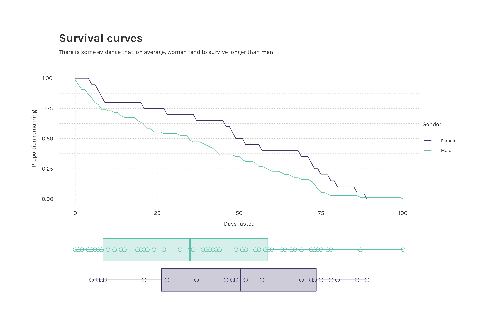
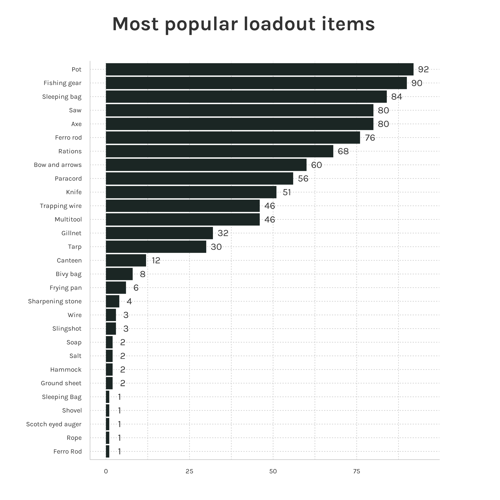

```{r, echo=FALSE}
library(alone)
suppressPackageStartupMessages(library(dplyr))
suppressPackageStartupMessages(library(ggplot2))
suppressPackageStartupMessages(library(tidyr))
```


# alone 

A collection of datasets on the [Alone](https://www.history.com/shows/alone) survival TV series in tidy format. Included in the package are 4 datasets detailed below. 

For non-Rstats users here is the link to the [Google sheets doc](https://docs.google.com/spreadsheets/d/1-ZGasLGFVv6t50cOOhcA0SW68jdBIASTh3KFA2o1PQY/edit?usp=sharing).

# Installation

Install from Github:
  
```{r, eval = FALSE}
devtools::install_github("doehm/alone")
```

# Datasets

## `survivalists`

A data frame of survivalists across all 9 seasons detailing name and demographics, location and profession, result, days lasted, reasons for tapping out (detailed and categorised), page URL.

```{r}
survivalists |> 
  glimpse()
```


```{r, eval = FALSE}
df <- expand_grid(
  days_lasted = 0:max(survivalists$days_lasted),
  gender = unique(survivalists$gender)
) |> 
  left_join(
    survivalists |> 
      count(days_lasted, gender),
    by = c("days_lasted", "gender")
  ) |> 
  left_join(
    survivalists |> 
      count(gender, name = "N"),
    by = "gender"
  ) |> 
  group_by(gender) |> 
  mutate(
    n = replace_na(n, 0),
    n_lasted = N-cumsum(n),
    p = n_lasted/N
  ) 

# Kaplan-Meier survival curves
df |> 
  ggplot(aes(days_lasted, p, colour = gender)) +
  geom_line() 

# boxplots
survivalists |> 
  ggplot(aes(days_lasted, fill = gender)) +
  geom_boxplot(alpha = 0.5) +
  geom_jitter(width = 0.2, pch = 1, size = 3) +
  theme_minimal()

```



  
## `loadouts`
  
Information on each survivalist's loadout of 10 items. It includes a detailed item description and a simplified version for easier aggregation and analysis.

```{r}
loadouts |> 
  glimpse()
```

```{r, eval = FALSE}
loadouts |>
  count(item) |>
  mutate(item = forcats::fct_reorder(item, n, max)) |>
  ggplot(aes(item, n)) +
  geom_col(fill = pal[1]) +
  geom_text(aes(item, n + 3, label = n), family = ft, size = 12, colour = txt) +
  coord_flip()
```



## `episodes`

Contains details of each episode including the title, number of viewers, beginning quote and IMDb rating

```{r}
episodes |> 
  glimpse()
```

## `seasons`

Season summary includes location and other season level information. It includes the date of drop off for the 3 latest seasons but need to be completed for the first 6 seasons.

```{r}
seasons |> 
  glimpse()
```


