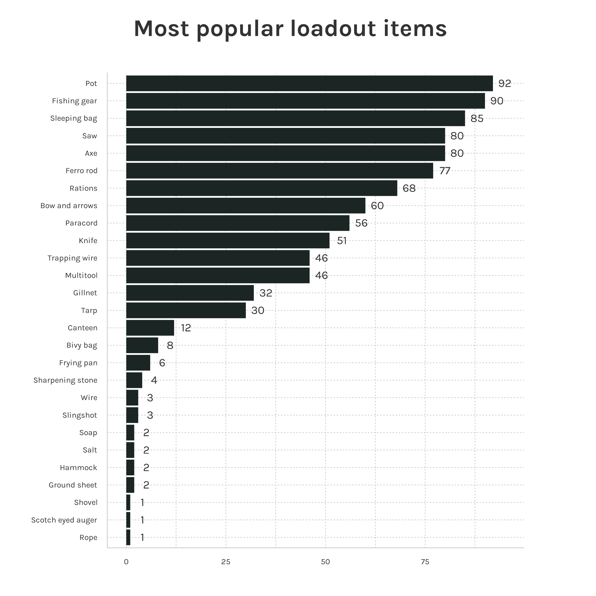

```{r, echo=FALSE}
library(alone)
suppressPackageStartupMessages(library(dplyr))
suppressPackageStartupMessages(library(ggplot2))
suppressPackageStartupMessages(library(tidyr))
```

# alone 

A collection of datasets on the [Alone](https://www.history.com/shows/alone) survival TV series in tidy format. Included in the package are 4 datasets detailed below. 

For non-Rstats users here is the link to the [Google sheets doc](https://docs.google.com/spreadsheets/d/1-ZGasLGFVv6t50cOOhcA0SW68jdBIASTh3KFA2o1PQY/edit?usp=sharing).

# Installation

Install from CRAN:

```{r, eval = FALSE}
install.packages("alone")
```

Install from Github:
  
```{r, eval = FALSE}
devtools::install_github("doehm/alone")
```

# Datasets

## `survivalists`

A data frame of survivalists across all 9 seasons detailing name and demographics, location and profession, result, days lasted, reasons for tapping out (detailed and categorised), page URL.

Dataset features:

* `version`: The version country code (currently only US but getting preppred or other versions)
* `season`: The season number
* `id`: Survivalist unique ID
* `name`: Name of the survivalist
* `first_name`: First name of the survivalist
* `last_name`: last name of the survivalist
* `age`: Age of survivalist
* `gender`: Gender
* `city`: City
* `state`: State
* `country`: Country
* `result`: Place the survivalist finished in the season
* `days_lasted`: The number of days lasted in the game before tapping out or winning
* `medically_evacuated`: Logical. If the survivalist was medically evacuated from the game
* `reason_tapped_out`: The reason the survivalist tapped out of the game. `NA` means they were the winner
* `reason_category`: A simplified category of the reason for tapping out
* `team`: The team they were associated with (only for season 4)
* `day_linked_up`: Day the team members linked up
* `profession`: Profession


```{r, eval = FALSE}
library(tidyverse)

df <- expand_grid(
  days_lasted = 0:max(survivalists$days_lasted),
  gender = unique(survivalists$gender)
) |> 
  left_join(
    survivalists |> 
      count(days_lasted, gender),
    by = c("days_lasted", "gender")
  ) |> 
  left_join(
    survivalists |> 
      count(gender, name = "N"),
    by = "gender"
  ) |> 
  group_by(gender) |> 
  mutate(
    n = replace_na(n, 0),
    n_lasted = N-cumsum(n),
    p = n_lasted/N
  ) 

# Kaplan-Meier survival curves
df |> 
  ggplot(aes(days_lasted, p, colour = gender)) +
  geom_line() 

# boxplots
survivalists |> 
  ggplot(aes(days_lasted, fill = gender)) +
  geom_boxplot(alpha = 0.5) +
  geom_jitter(width = 0.2, pch = 1, size = 3) +
  theme_minimal()

```


  
## `loadouts`
  
Each survivalist is allowed to take with them 10 items. This dataset includes information on each survivalist's loadout. It has detailed item descriptions and a simplified version for easier aggregation and analysis.

* `version`: Country code for the version of the show
* `season`: The season number
* `id`: Survivalist unique ID
* `name`: Name of the survivalist
* `item_number`: Item number
* `item_detailed`: Detailed loadout item description
* `item`: Loadout item. Simplified for aggregation

```{r, eval = FALSE}
library(forcats)

loadouts |>
  count(item) |>
  mutate(item = fct_reorder(item, n, max)) |>
  ggplot(aes(item, n)) +
  geom_col() +
  geom_text(aes(item, n + 3, label = n), family = ft, size = 12, colour = txt) +
  coord_flip()
```



## `episodes`

This dataset contains details of each episode including the title, number of viewers, beginning quote and IMDb rating. New episodes will be added at the end of future seasons.

* `version`: Country code for the version of the show
* `season`: The season number
* `episode_number_overall`: Episode number across seasons
* `episode`: Episode number
* `title`: Episode title
* `air_date`: Date the episode originally aired
* `viewers`: Number of viewers in the US (millions)
* `quote`: The beginning quote
* `author`: Author of the beginning quote
* `imdb_rating`: IMDb rating of the episode
* `n_ratings`: Number of ratings given for the episode

## `seasons`

The season summary dataset includes location, latitude and longitude, and other season level information. It includes the date of drop off where the information exists.

* `version`: Country code for the version of the show
* `season`: The season number
* `location`: Location
* `country`: Country
* `n_survivors`: Number of survivalists. Season 4 there were 7 teams of 2.
* `lat`: Latitude
* `lon`: Longitude
* `date_drop_off`: Date the survivalists were dropped off

If there is any data you would like to include please get in touch.

## References

1. History: https://www.history.com/shows/alone/cast
2. Wikipedia: https://en.wikipedia.org/wiki/Alone_(TV_series)
3. Wikipedia (episodes): https://en.wikipedia.org/wiki/List_of_Alone_episodes#Season_1_(2015)_-_Vancouver_Island
