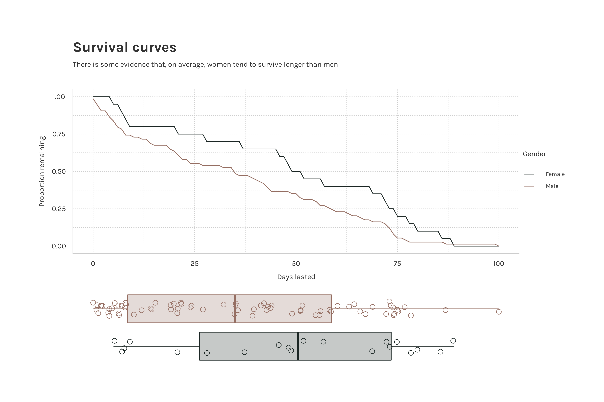

# alone 

A collection of datasets on the
[Alone](https://www.history.com/shows/alone) survival TV series in tidy
format. Included in the package are 4 datasets detailed below.

For non-Rstats users here is the link to the [Google sheets
doc](https://docs.google.com/spreadsheets/d/1-ZGasLGFVv6t50cOOhcA0SW68jdBIASTh3KFA2o1PQY/edit?usp=sharing).

# Installation

Install from Github:

``` r
devtools::install_github("doehm/alone")
```

# Datasets

## `survivalists`

A data frame of survivalists across all 9 seasons detailing name and
demographics, location and profession, result, days lasted, reasons for
tapping out (detailed and categorised), page URL.

``` r
survivalists |> 
  glimpse()
```

    ## Rows: 94
    ## Columns: 16
    ## $ season              <dbl> 1, 1, 1, 1, 1, 1, 1, 1, 1, 1, 2, 2, 2, 2, 2, 2, 2,…
    ## $ name                <chr> "Alan Kay", "Sam Larson", "Mitch Mitchell", "Lucas…
    ## $ age                 <dbl> 40, 22, 34, 32, 37, 44, 46, 24, 41, 31, 50, 44, 45…
    ## $ gender              <chr> "Male", "Male", "Male", "Male", "Male", "Male", "M…
    ## $ city                <chr> "Blairsville", "Lincoln", "Bellingham", "Quasqueto…
    ## $ state               <chr> "Georgia", "Nebraska", "Massachusetts", "Iowa", "P…
    ## $ country             <chr> "United States", "United States", "United States",…
    ## $ result              <dbl> 1, 2, 3, 4, 5, 6, 7, 8, 9, 10, 1, 2, 3, 4, 5, 6, 7…
    ## $ days_lasted         <dbl> 56, 55, 43, 39, 8, 6, 4, 4, 1, 0, 66, 64, 59, 57, …
    ## $ medically_evacuated <lgl> FALSE, FALSE, FALSE, FALSE, FALSE, FALSE, FALSE, F…
    ## $ reason_tapped_out   <chr> NA, "Lost the mind game", "Realized he should actu…
    ## $ reason_category     <chr> NA, "Family / personal", "Family / personal", "Fam…
    ## $ team                <chr> NA, NA, NA, NA, NA, NA, NA, NA, NA, NA, NA, NA, NA…
    ## $ day_linked_up       <dbl> NA, NA, NA, NA, NA, NA, NA, NA, NA, NA, NA, NA, NA…
    ## $ profession          <chr> "Corrections Officer", "Outdoor Gear Retailer", "B…
    ## $ url                 <chr> "alan-kay", "sam-larson", "mitch-mitchell", "lucas…

``` r
df <- expand_grid(
  days_lasted = 0:max(survivalists$days_lasted),
  gender = unique(survivalists$gender)
) |> 
  left_join(
    survivalists |> 
      count(days_lasted, gender),
    by = c("days_lasted", "gender")
  ) |> 
  left_join(
    survivalists |> 
      count(gender, name = "N"),
    by = "gender"
  ) |> 
  group_by(gender) |> 
  mutate(
    n = replace_na(n, 0),
    n_lasted = N-cumsum(n),
    p = n_lasted/N
  ) 

# Kaplan-Meier survival curves
df |> 
  ggplot(aes(days_lasted, p, colour = gender)) +
  geom_line() 

# boxplots
survivalists |> 
  ggplot(aes(days_lasted, fill = gender)) +
  geom_boxplot(alpha = 0.5) +
  geom_jitter(width = 0.2, pch = 1, size = 3) +
  theme_minimal()
```



## `loadouts`

Information on each survivalist’s loadout of 10 items. It includes a
detailed item description and a simplified version for easier
aggregation and analysis.

``` r
loadouts |> 
  glimpse()
```

    ## Rows: 940
    ## Columns: 6
    ## $ version       <chr> "US", "US", "US", "US", "US", "US", "US", "US", "US", "U…
    ## $ season        <dbl> 1, 1, 1, 1, 1, 1, 1, 1, 1, 1, 1, 1, 1, 1, 1, 1, 1, 1, 1,…
    ## $ name          <chr> "Alan Kay", "Alan Kay", "Alan Kay", "Alan Kay", "Alan Ka…
    ## $ item_number   <dbl> 1, 2, 3, 4, 5, 6, 7, 8, 9, 10, 1, 2, 3, 4, 5, 6, 7, 8, 9…
    ## $ item_detailed <chr> "Saw", "Axe", "Sleeping bag", "Large 2-quart pot", "Ferr…
    ## $ item          <chr> "Saw", "Axe", "Sleeping bag", "Pot", "Ferro rod", "Cante…

``` r
loadouts |>
  count(item) |>
  mutate(item = forcats::fct_reorder(item, n, max)) |>
  ggplot(aes(item, n)) +
  geom_col(fill = pal[1]) +
  geom_text(aes(item, n + 3, label = n), family = ft, size = 12, colour = txt) +
  coord_flip()
```


## `episodes`

Contains details of each episode including the title, number of viewers,
beginning quote and IMDb rating

``` r
episodes |> 
  glimpse()
```

    ## Rows: 98
    ## Columns: 11
    ## $ version                <chr> "US", "US", "US", "US", "US", "US", "US", "US",…
    ## $ season                 <dbl> 1, 1, 1, 1, 1, 1, 1, 1, 1, 1, 1, 2, 2, 2, 2, 2,…
    ## $ episode_number_overall <dbl> 1, 2, 3, 4, 5, 6, 7, 8, 9, 10, 11, 12, 13, 14, …
    ## $ episode                <dbl> 1, 2, 3, 4, 5, 6, 7, 8, 9, 10, 11, 1, 2, 3, 4, …
    ## $ title                  <chr> "And So It Begins", "Of Wolf and Man", "The Tal…
    ## $ air_date               <chr> "2015-06-18", "2015-06-25", "2015-07-02", "2015…
    ## $ viewers                <dbl> 1.582, 1.697, 1.864, 2.082, 2.082, 2.181, 2.092…
    ## $ quote                  <chr> "I went to the woods because I wished to live d…
    ## $ author                 <chr> "Henry David Thoreau", "Nikita Khrushchev", "Ca…
    ## $ imdb_rating            <dbl> 7.5, 7.7, 7.7, 7.7, 7.6, 7.6, 7.7, 7.7, 7.7, 8.…
    ## $ n_ratings              <dbl> 135, 110, 104, 104, 99, 99, 97, 99, 93, 102, 75…

## `seasons`

Season summary includes location and other season level information. It
includes the date of drop off for the 3 latest seasons but need to be
completed for the first 6 seasons.

``` r
seasons |> 
  glimpse()
```

    ## Rows: 9
    ## Columns: 8
    ## $ version       <chr> "US", "US", "US", "US", "US", "US", "US", "US", "US"
    ## $ season        <dbl> 1, 2, 3, 4, 5, 6, 7, 8, 9
    ## $ location      <chr> "Quatsino", "Quatsino", "Patagonia", "Quatsino", "Seleng…
    ## $ country       <chr> "Canada", "Canada", "Argentina", "Canada", "Mongolia", "…
    ## $ n_survivors   <dbl> 10, 10, 10, 14, 10, 10, 10, 10, 10
    ## $ lat           <dbl> 50.72444, 50.72444, -41.00000, 50.72444, 49.75000, 61.50…
    ## $ lon           <dbl> -127.49806, -127.49806, -68.00000, -127.49806, 106.50000…
    ## $ date_drop_off <chr> NA, NA, NA, NA, NA, NA, "2019-09-18", "2020-09-18", "202…
